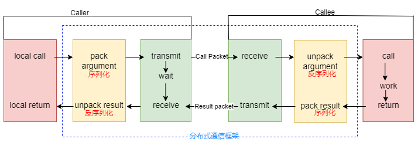
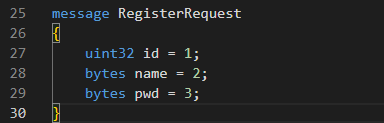
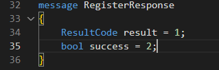
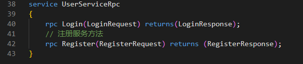
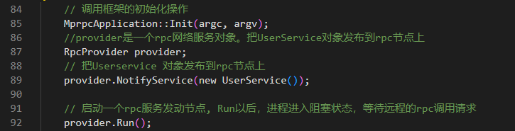
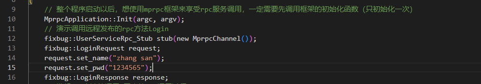
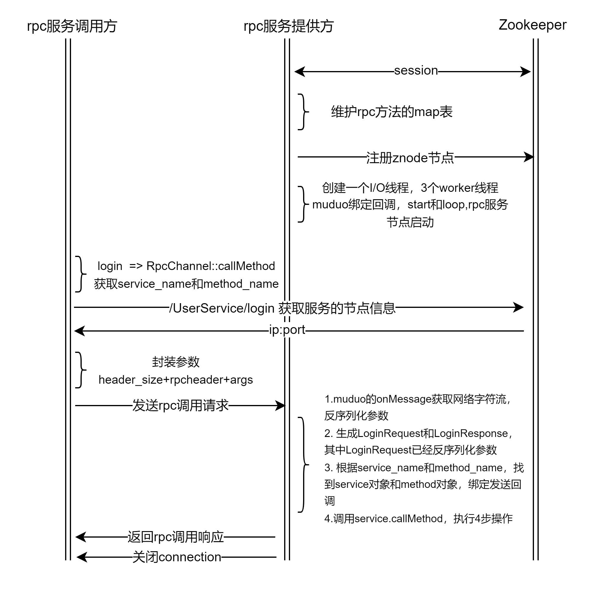

# mprpc

- [项目介绍](#项目介绍)
- [功能介绍](#功能介绍)
- [开发环境](#开发环境)
- [总体框架](#总体框架)
- [技术点](#技术点)

# 项目介绍

* 基于c++开发的分布式网络框架，项目基于muduo高性能网络库和Protobuf开发，主要功能是通过zookeeper实现服务注册以及发现，muduo网络库以及Protobuf实现远程RPC调用，基于线程安全的缓冲队列实现异步日志。

# 功能介绍

作为一个框架类项目，提供的功能主要是服务的注册，和服务的调用，在不同节点上的进程调用远程服务。



上图中黄色部分：设计rpc方法参数的打包和解析，也就是借助Protobuf实现数据的序列化和反序列化。

绿色部分：是框架的网络部分，功能包括寻找rpc服务主机，发起rpc调用请求和响应rpc调用结果，使用muduo网络库和zookeeper服务配置中心实现。

* 本地服务部署成rpc服务

为处理方法名、方法参数和方法返回值的序列化和反序列化，服务的**提供者**编写对应的proto文件，对方法名、方法参数和方法返回值进行描述：

方法参数：



返回值参数：



服务方法描述：



通过编写的proto文件，生成数据结构的源代码*.pb.h *.pb.cc，这些源码提供了读写数据结构的接口，从而能够构造、初始化、读取、序列化和反序列化数据结构。

服务的**提供者**创建服务类`UserService`继承protobuf源文件中的`UserServiceRpc`类，并重写rpc方法`Register`。当调用者请求服务方法，框架自动调用该重写函数，函数内部通过请求参数调用本地业务方法。声明实现了服务类后，将该服务`UserService`通过框架的NotifyService方法发布到rpc节点上。框架的网络服务对象provider启动时，将服务对象和服务方法注册到zookeeper上。



* 调用远程rpc服务

先初始化框架，创建**调用方**的请求服务对象，然后准备请求参数：



接着通过服务对象发起服务方法请求

```c++
stub.Login(nullptr, &request, &response, nullptr); 
```


# 开发环境

g++ 9.4.0

ubuntu 20.04.2

libprotoc 3.11.0

# 总体框架

bin :可执行文件，保存编译服务的调用则和提供者的可执行文件

build :编译的中间文件

example: 服务的调用则和提供者代码

lib: 存放框架最终编译出来的静态库

src：框架源码



# 技术点

* RPC远程过程调用
* Protobuf数据序列化和反序列化
* Zookeeper分布式一致性协调服务应用
* moduo网络库编程
* conf配置文件读取
* 异步日志
* CMake构建项目集成编译环境